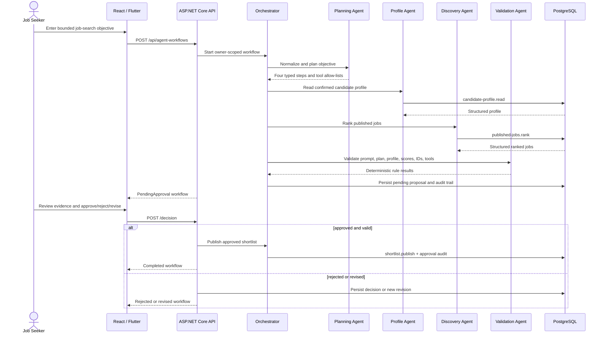

# Controlled agent workflow

The four agents have separate responsibilities, but all tool execution remains server controlled. Objective text cannot select a tool. Tool inputs and outputs are JSON contracts, each call is timed and stored, transient failures are retried once, each step is bounded by a timeout, and no shortlist becomes visible as approved before the owner acts at the human gate.
