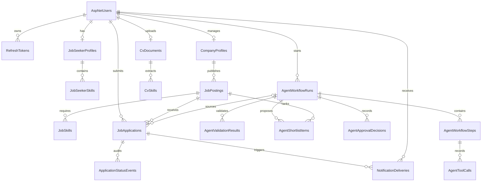

# Entity relationship diagram

The diagram focuses on application-owned tables. ASP.NET Core Identity also creates its standard role, claim, login, token, and user-role tables around `AspNetUsers`.

Important integrity rules include one profile and one CV per Job Seeker, one company per Recruiter, unique skills inside their parent, one application per seeker/job pair, unique shortlist rank and job within a workflow, indexed ownership/status queries, restricted deletion of referenced jobs, and cascading deletion only for true owned child records. EF Core migrations in `backend/src/NextRoleAI.Infrastructure/Persistence/Migrations` are the executable schema history.
