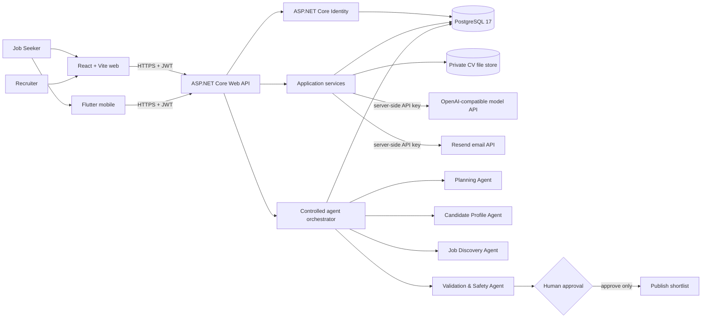

# System architecture

NextRoleAI uses one HTTP API as the trust boundary for both clients. Browser and mobile code never connect directly to PostgreSQL, CV storage, the AI/notification providers, or agent tools.

## Backend boundaries

- `NextRoleAI.Api` owns HTTP concerns, Swagger, authentication middleware, CORS, and composition.
- `NextRoleAI.Application` owns use-case contracts and service interfaces.
- `NextRoleAI.Domain` owns entities, statuses, and business rules.
- `NextRoleAI.Infrastructure` owns EF Core/PostgreSQL, Identity, private file storage, AI-provider integration, and Resend.
- `NextRoleAI.AgenticAI` owns bounded orchestration, allow-listed tools, validation, retries, timeouts, and approval gates.

## Deployment topology

The supplied Render Blueprint creates a private PostgreSQL database, a Docker-hosted API, and a static React site in the Singapore region. Flutter uses the same public API URL. Secrets are dashboard environment variables; no credential is committed. The free deployment stores CVs in an ephemeral private directory, so a redeploy can remove uploaded files. A persistent Render disk or an object-storage implementation is the production upgrade path.
